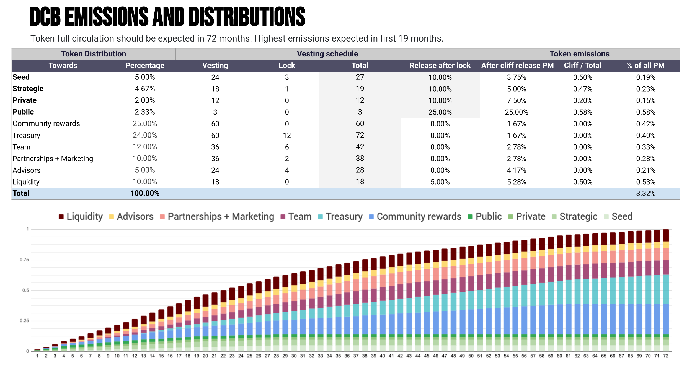

Decubate's token, DCB, is a critical component of our ecosystem. It provides investment rights to stakers, enables community governance, and facilitates access to our products and services. Our tokenomics have been carefully designed to ensure the long-term success of our platform and the value of DCB.

### Token Distribution
We have a total token supply of 1 billion DCB. The distribution of tokens is as follows:
- Seed: 5.00% (50 million tokens)
- Strategic: 4.67% (46.7 million tokens)
- Private: 2.00% (20 million tokens)
- Public: 2.33% (23.3 million tokens)
- Community rewards: 25.00% (250 million tokens)
- Treasury: 24.00% (240 million tokens)
- Team: 12.00% (120 million tokens)
- Partnerships + Marketing: 10.00% (100 million tokens)
- Advisors: 5.00% (50 million tokens)
- Liquidity: 10.00% (100 million tokens)

### Token Vesting
To ensure that our token distribution is fair and controlled, we have implemented vesting periods for all categories of tokens.

- Strategic: 4.67% of the total supply is reserved for the Strategic round. These tokens are vested for 18 months, with a 1-month lockup period.
- Private: 2% of the total supply is reserved for the Private round. These tokens are fully unlocked after 12 months.
- Public: 2.33% of the total supply is reserved for the Public round. These tokens are fully unlocked after 3 months.
- Community rewards: 25% of the total supply is reserved for community rewards. These tokens are fully unlocked after 60 months.
- Treasury: 24% of the total supply is reserved for the Treasury. These tokens are vested for 60 months, with a 12-month lockup period.
- Team: 12% of the total supply is reserved for the Team. These tokens are vested for 36 months, with a 6-month lockup period.
- Partnerships + Marketing: 10% of the total supply is reserved for Partnerships and Marketing. These tokens are vested for 36 months, with a 2-month lockup period.
- Advisors: 5% of the total supply is reserved for Advisors. These tokens are vested for 24 months, with a 4-month lockup period.
- Liquidity: 10% of the total supply is reserved for Liquidity. These tokens are fully unlocked after 18 months.
Token Burn

To ensure the scarcity of our token and the long-term value of our ecosystem, we have implemented a token burn mechanic. Our platform will burn a portion of DCB tokens periodically to reduce the total supply. This will increase the value of the remaining tokens and create a deflationary effect that benefits all stakeholders.

## Conclusion
Decubate's tokenomics are designed to ensure the long-term success of our platform and the value of our token. With carefully controlled distribution, vesting periods, and a token burn mechanic, we aim to create a sustainable ecosystem that benefits all stakeholders.