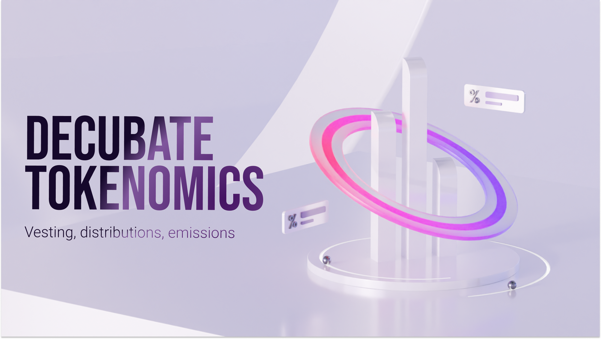
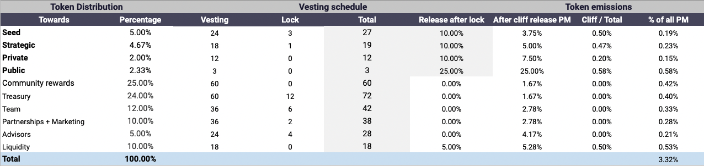
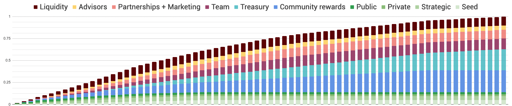
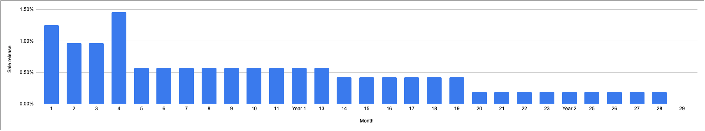

Decubate's token, DCB, is a critical component of our ecosystem. It provides investment rights to stakers, enables community governance, and facilitates access to our products and services. Our tokenomics have been carefully designed to ensure the long-term success of our platform and the value of DCB.

### Token Distribution
We have a total token supply of 1 billion DCB. The distribution of tokens is as follows:

### Token Vesting

To ensure the scarcity of our token and the long-term value of our ecosystem, we have implemented a token burn mechanic. Our platform will burn a portion of DCB tokens periodically to reduce the total supply. This will increase the value of the remaining tokens and create a deflationary effect that benefits all stakeholders.

### Early DCB investor emissions
Full vesting duration for all early DCB investors will take place in 28 months. We expect early investor sell pressure to ease up significantly after 19 months (Januari 2023) from 0.42% to 0.19% monthly emissions.

## Conclusion
Decubate's tokenomics are designed to ensure the long-term success of our platform and the value of our token. With carefully controlled distribution, vesting periods, and a token burn mechanic, we aim to create a sustainable ecosystem that benefits all stakeholders.