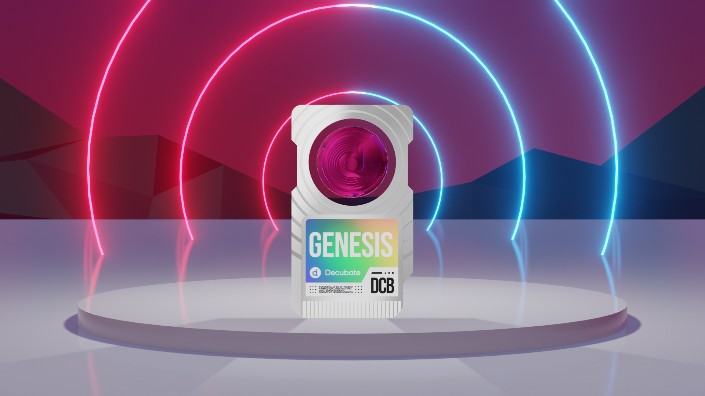

# Decubate Genesis NFT

The Decubate Genesis NFT is an innovative digital asset designed to enhance the user experience on the Decubate platform by offering additional benefits such as boosting staking rewards and holding the potential for future rewards and exclusive access. Decubate has minted a total of 570 Genesis NFTs. This page will detail the benefits, utilities, and workings of the Decubate Genesis NFT, showcasing its role in staking APY boost and the potential future benefits it brings to investors.

## Staking APY Boost

One of the primary utilities of the Decubate Genesis NFT is its ability to boost the APY (Annual Percentage Yield) of DCB staking rewards. Users who hold the Genesis NFT in their wallets enjoy an automatic and significant increase in their staking rewards on the Decubate platform, enabling them to earn more DCB tokens for their staked investment.

**Key Benefit:**
- Enhanced APY on DCB staking rewards for Genesis NFT holders

## How the Decubate Genesis NFT Works

The Decubate Genesis NFT functions as a unique digital asset that users can hold in their wallets. When users stake their DCB tokens on the Decubate platform and simultaneously hold the Genesis NFT in their wallets, the smart contract system recognizes the NFT and automatically applies the APY boost to the user's staking rewards.

**Genesis NFT Process:**
1. Hold the Genesis NFT in your wallet
2. Stake DCB tokens on the Decubate platform
3. Smart contract system recognizes the NFT and applies the APY boost

## Where can I buy a Genesis NFT?
Decubate has minted several NFTs for different project but there is only one Decubate Genesis.

***You can buy Genesis NFT on the following market places:***
[!ref target="blank" text="Tofunft"](https://tofunft.com/collection/decubate/items)
[!ref target="blank" text="NFTrade"](https://nftrade.com/collection/decubate?traitIds=)
[!ref target="blank" text="Opensea"](https://opensea.io/collection/decubate)

## Potential Future Benefits

The Decubate Genesis NFT not only offers immediate benefits in the form of enhanced staking rewards but also holds the potential for future benefits as the platform continues to evolve and expand. As Decubate introduces new features, services, and investment opportunities, the Genesis NFT may unlock additional utilities and exclusive access for its holders.

**Potential Future Benefits:**
- Exclusive access to new projects
- Increased governance power
- Special events and promotions
- Enhanced Learn to Earn rewards

In conclusion, the Decubate Genesis NFT is a valuable asset for investors in the Decubate ecosystem. By investing in the Decubate Genesis NFT, users can maximize their investment potential and actively contribute to the growth and success of the Decubate platform and the web3 projects it supports.