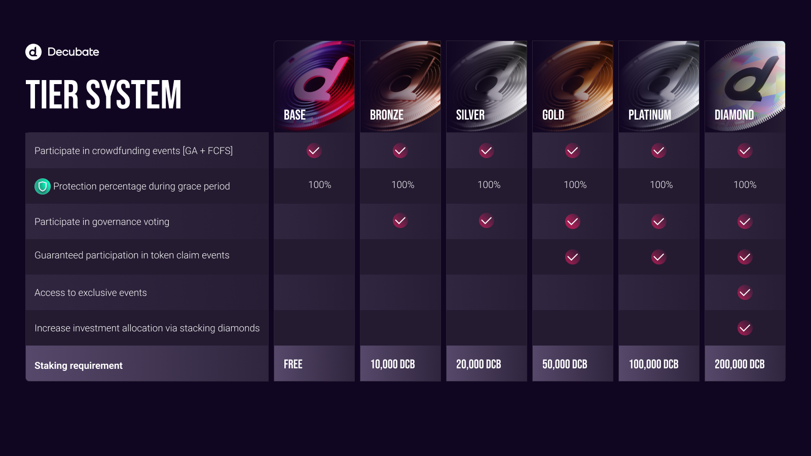

# Decubate Made Simple: A Step-by-Step Guide to Joining Events
As a DCB token investor, you become an integral part of our thriving ecosystem, driving innovation and shaping the future of the decentralized economy. Our all-in-one platform offers a unique blend of investment opportunities and exclusive access to groundbreaking web3 projects, allowing you to contribute directly to their success. The DCB token is vital to our ecosystem, providing staking benefits, enabling community governance, and opening doors to lucrative projects. By investing in DCB, you gain the power to influence the direction of Decubate and share in the triumphs of the web3 businesses we support. Join us in our vision to lead the charge in accessible, innovative, and reliable web3 solutions and experience the rewards of empowering the entrepreneurs of tomorrow.

## DCB Token Utility:
- <b>Staking benefits:</b> Earn rewards and incentives by staking DCB tokens.
- <b>Community governance:</b> Participate in crucial decision-making processes and influence the platform's direction.
- <b>Access to lucrative projects:</b> Gain exclusive entry to promising web3 projects and investment opportunities.
- <b>Enhanced voting power:</b> The more DCB tokens staked, the greater your influence in the governance process.
- <b>Learn to Earn Events:</b> Decubate hosts Learn to Earn events in collaboration with post/pre-listed projects seeking to promote their initiatives. These events provide an engaging and educational platform for Decubate users to learn about new web3 projects and ear

## How To Join Decubate’s Investor Club

### 1. Setting up an Account

To begin using Decubate, follow these steps:

1. Visit the [Decubate website](https://www.decubate.com/) and click on "Sign Up."
2. Enter your email address, create a secure password, read and agree to the terms and conditions.
3. Verify your email address by clicking the verification link sent to your inbox.
4. Log in to your Decubate account and navigate to the "Profile" tab.
5. Click "Start KYC" and follow the on-screen instructions to get KYC verification.

### 2. Buy Decubate tokens to upgrade your tier

### Stake you DCB to earn a tier

1. Head over to https://platform.decubate.com/staking
2. Connect your wallet that hold DCB.
3. Choose a staking pool or liquidity pool.
4. Stake it in any of our staking pools to secure your investor club membership. Please review the benefits chart above to inform your membership level selection and the corresponding DCB staking requirement.

## How to join IDO's, crowdfundings, learn to earn events and giveaways?
### 1. Whitelist for events:
As a Decubate member, you can participate in Crowdfunding, Learn to Earn, giveaways, and airdrop events. These events are all tier-based, with higher tiers receiving more significant rewards or chances of winning.

### 2. Participate in crowdfunding events:
To participate in crowdfunding events, you must agree to our terms and conditions and accept the project SAFT. All events will have three rounds, the Guaranteed Allocation (GA), and two First Come, First Serve rounds (FCFS).

### Step 3: Claim tokens!
You’re all set. Claim tokens through your investment dashboard with a click of a button!

## FAQ
#### Q: Can I stake DCB tokens in multiple pools?
Yes. Our smart contracts are truly smart. They calculate your total amount staked in all pools to determine your tier.

#### Q: What happens if I add tokens to a pool where I already stake?
Your rewards are compounded and the lock duration is reset for your entire stack.

#### Q: How do I receive project tokens if they have vesting?
Each project may have its unique vesting period and release schedule, which will be clearly outlined in its terms and conditions. Once the tokens become available, you can claim them through Decubate according to the vesting schedules.

#### Q: Does Decubate have a refund policy?
Decubate facilitates partial protection depending on your tier, where users can request a refund during a predetermined grace period if they haven’t claimed any vested tokens. Decubate complies with Dutch regulations and does not hold or manage user funds. Therefore, there are no conditions for which users can request refunds. It’s up to the user to decide whether to refund their investment during the grace period. All fees paid for the investment protection go automatically to buying back DCB or DCB liquidity pools.

#### Q: How can I increase my investment protection?
Investors can increase the investment protection percentage during the grace period by upgrading their tier. Decubate Base tier will have no protection, Bronze 50%, Silver 75%, Gold 80%, Platinum 90%, Diamond 95%, and each additional diamond stacked will increase protection by 0.5%. 

This option promotes informed investment decisions while incentivizing users to upgrade their tiers, increasing DCB buybacks & burn and liquidity after crowdfunding events.

#### Q: I claimed tokens but I want to refund my investment
Unfortunately that's not possible. Decubate doesn't even have access to your funds, project funds, or manages your investments. Decubate platform facilitates token sales through smart contracts that can't be changed or revised. If you have claimed your vested tokens, you forfeit the right to ask for a refund and there is nothing Decubate can do about it.