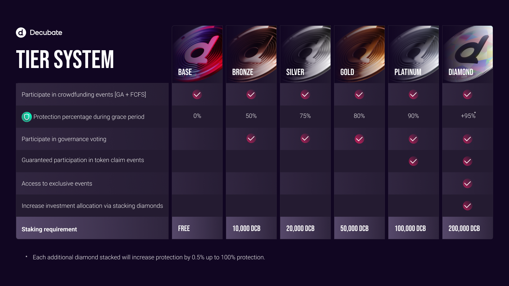

# Club Overview
They say it’s hard to master two things at once. We disagree. In addition to developing industry-leading web3 software products, we operate a members-only investor club.

- Investor club: a web3 investment community that’s focused on value creation. Members participate in token sales, token airdrops, staking pools, liquidity pools and more.
- Personalized investment portfolio: track the status of all of your investor club activities in one place.
Safe & secure: all investor club smart contracts have been audited by an industry-leading security firm.
- Membership in minutes: create an account, KYC and meet the Decubate token (DCB) staking requirement to join up.

## Benefits
1. Invest in highly-vetted web3 projects.
2. Generate passive recurring income.
3. Earn token airdrops and NFTs.

## Features
- Participate in token sales of highly-vetted projects
- Receive limited-edition NFTs for participating in project token sales
- Earn free tokens from partner projects
- Receive DCB rewards for staking DCB
- Receive partner token rewards for staking DCB
- Receive DCB and partner token rewards for providing liquidity
- Keep track of all your Decubate related investments in one place
- Socialize and learn from a sophisticated group of like-minded investors
- Earn DCB rewards for successfully onboarding new investor club members
- Governance: coming soon
- Reputation system: coming soon
- Token Burning: coming soon

## Membership
Value creation starts here. Join our investor club to access early-stage investment opportunities. 

To become an investor club member, complete the following steps. 
1. First, create a Decubate account. Be sure to successfully complete both identity and wallet verification
2. Buy DCB tokens from PancakeSwap or Bitmart

[!ref target="blank" text="PancakeSwap"](https://pancakeswap.finance/swap)
[!ref target="blank" text="Bitmart"](https://www.bitmart.com/trade/en-US?symbol=DCB_USDT)

3. Secure your Decubate membership by staking our DCB token in one of our staking pools. To increase your level, simply meet the corresponding staking requirement. Your membership level will appear on the upper right hand side of the Decubate platform (you must be logged in to view it).

[!ref target="blank" text="Create your account"](https://platform.decubate.com/register)

The investor club consists of six levels of membership. Simply meet the Decubate token (DCB) staking requirement of your desired membership level. The benefits of each membership level are outlined in the image below. Note* The difference between Base, Bronze and Silver membership levels is the investment allocation amount for crowdfunding events (token sales). 