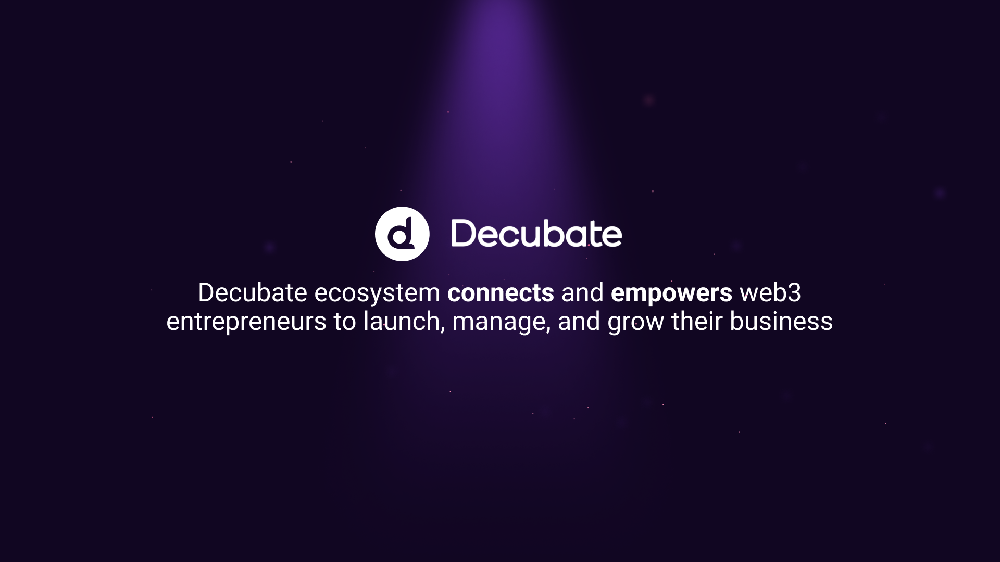

# The Ecosystem Unveiled

The Decubate Ecosystem stands as a steadfast bastion of innovation and progress. Here, projects and businesses find not just a platform, but a robust infrastructure designed to empower and elevate their endeavors. Our ethos revolves around fostering an environment where ingenuity flourishes and visionary ideas find fertile ground.

We approach project selection with meticulous care and discernment. Each project is rigorously [evaluated](https://www.decubate.com/blog/a-look-inside-decubates-evaluation-process) to ensure alignment with our core values and the overarching goals of blockchain technology. This commitment to excellence ensures that every addition to our ecosystem contributes meaningfully to the collective advancement of Web3.

Beyond mere transactional interactions, Decubate cultivates a community of forward-thinkers and industry leaders. As projects journey through our ecosystem, they are met with **support, guidance, and collaborative opportunities** that transcend the traditional bounds of a simple platform. Here, we strive to push the boundaries of what's possible and pioneer new frontiers.

Our relentless dedication to excellence and unwavering integrity make Decubate the paramount choice for projects seeking to thrive in the Web3. Join us, and together, let's pioneer the future of decentralized finance and technology, setting new standards of innovation and trust. **Join the ecosystem**, and together, let's lead the charge into the boundless frontier of decentralized finance and technology, where we'll shatter existing norms, redefine innovation, and establish unassailable pillars of trust.

[!ref target="blank" text="Apply Today"](https://share-eu1.hsforms.com/1H2ohLD8tSv-EQjMQEu7lhAf5bmh)