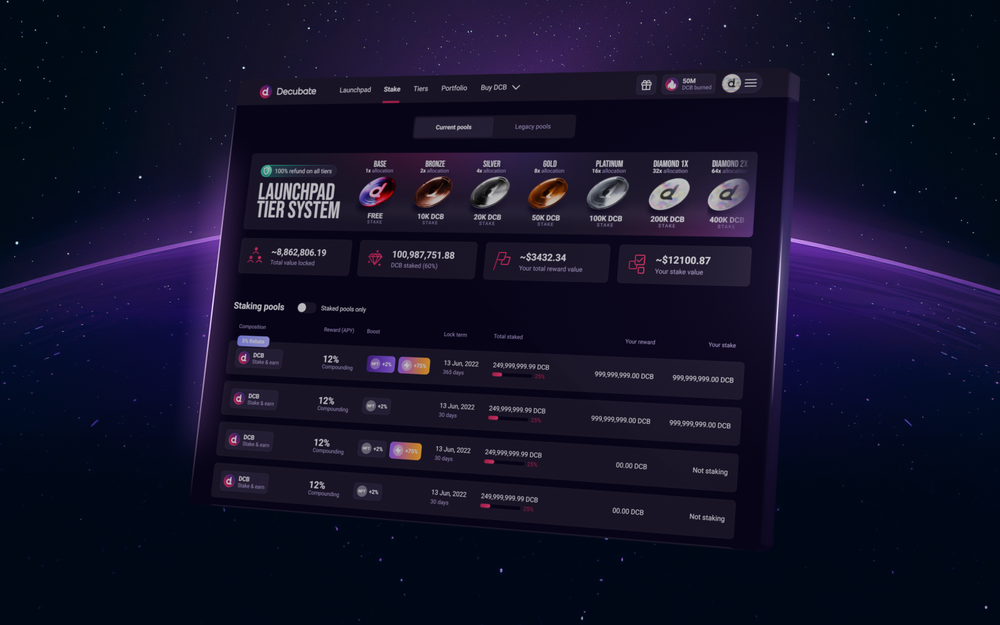

# White Label Staking Platform

Eliminate the need to invest valuable time and resources into crafting your own staking solution. Decubate provides everything you need to get started quickly and efficiently.

Imagine a world where your token holders are actively engaged, rewarded for their loyalty, and incentivized to hold for the long term. Decubate's [White Label Staking Platform](https://www.decubate.com/token-staking-platform) empowers you to achieve precisely that by providing a suite of tools designed to **easily design, deploy, and manage staking** pools that seamlessly integrate with your project's unique tokenomics.

## Token Utility and User Engagement
The Staking Platform grants you the ability to imbue your token with unparalleled utility, incentivizing users to actively participate in your ecosystem.

- **Reward Loyalty**: Cultivate a dedicated community by offering attractive staking rewards distributed in the form of tokens, NFTs, or even whitelisting privileges for exclusive events.
- **Stimulate Engagement**: Foster a vibrant user base by gamifying the staking experience. Users will be actively involved, monitoring their rewards and eagerly anticipating future staking pool offerings.
- **Promote Stability**: By locking tokens within staking pools, you inherently reduce circulating supply, contributing to greater price stability for your token.

## Pool Creation and Management
Decubate empowers you to take complete control over your staking program through our user-centric platform, eliminating the need for extensive technical expertise.

- **Intuitive Interface**: Effortlessly configure staking rewards, APY, pool duration, and capacity with our straightforward interface, designed for optimal usability.
- **Flexible Pool Options**: Tailor your staking program to your specific needs by selecting from a diverse range of staking pool types, including token-locking, liquidity token, or NFT staking pools.
- **Real-Time Analytics**: Gain valuable insights into pool performance with our comprehensive analytics dashboard. Monitor key metrics and adjust parameters as needed to optimize your staking program for maximum impact.

## Security and Customization
Decubate prioritizes the security of your assets and the integrity of your staking program.

- **Secure & Audited**: Our platform leverages robust, independently audited smart contracts to ensure the safety of your funds and the complete transparency of your staking program.
- **Seamless Brand Integration**: Maintain a cohesive brand experience by customizing your staking portal to perfectly reflect your unique brand identity.
- **EVM Compatibility**: Enjoy unparalleled flexibility by launching and managing staking pools on any EVM-compatible blockchain.

## How it Works & Key Features
[!embed height="400"](https://www.youtube.com/watch?v=Cvf-cqEWNQg)
Here's a closer look at what you can expect:

- **Effortless Pool Creation**: Set pool parameters, including APY, lock period, and capacity, in minutes with our intuitive interface.
- **Multiple Staking Options**: Choose from token-locking, liquidity token, or NFT staking pools to meet your specific needs.
- **Advanced Reward Structures**: Incentivize users with a variety of reward options, including token rewards, NFTs, and whitelisting.
- **NFT Boost Functionality**: Reward users who hold your NFTs with an APY boost, fostering deeper project engagement.
- **Mobile-Optimized Interface**: Ensure a smooth user experience for all stakeholders with a mobile-friendly staking portal.
- **Real-time Analytics Dashboard**: Gain valuable insights into pool performance and make informed decisions with data visualization tools.

|||
|||

## Some of our Partners officially using our Staking Solution

- [StoryFire](https://storyfire.com/)
- [Exverse](https://exv.io/)
- [YOUR](https://your.io/token)
- [eeSee](https://eesee.io/)
- [DexCheck](https://dexcheck.ai/)
- [AI Tech Solidus](https://aitech.io/)
- [ChainGPT](https://www.chaingpt.org/)
- [Tradetomato](https://www.tradetomato.com/)
- [Sidus Heroes](https://sidusheroes.com/)
- [Chappyz](https://chappyz.com/)

|||
|||

## Get Started Today with a Demo
Empower your tokenomics and unlock the full potential of your project with Decubate's white-label staking platform. Contact us today to learn more about how Decubate can help you achieve your goals. 
[!ref target="blank" text="Contact Us"](https://share-eu1.hsforms.com/1MAJTri8sRxO5OmKL7DaktQf5bmh)