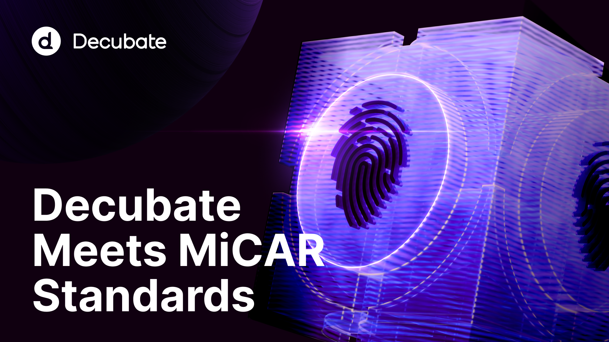

# Decubate & MiCAR: Ensuring Compliance and Security for Our Clients and Users

The crypto industry is evolving, and so are the regulations that shape it. With the introduction of the Markets in Crypto-Assets Regulation (MiCAR), all platforms offering crypto-asset services to EU users must secure a license to continue operating in the European market. At Decubate, we welcome this regulatory clarity and remain committed to full compliance while ensuring a seamless experience for our users.

--

## What Is MiCAR and Why Does It Matter?

MiCAR is the European Union’s comprehensive framework for regulating crypto-asset service providers (CASPs). It aims to create a unified and secure market, protecting investors while fostering innovation. One key requirement is that **all launchpads serving EU users must obtain a license** to continue offering services like token sales and placements.

Decubate **proactively applied for a MiCAR license in November 2024** and has worked closely with the **Dutch Authority for the Financial Markets (AFM)** to align our operations with the new regulations. The AFM has confirmed that **Decubate can continue operating during the transition period**, albeit with adjustments for EU-based users and clients while our license is being processed. Decubate expects to obtain the approved license in Q2 of 2025.

## What This Means for Decubate Users and Clients

To ensure full compliance with MiCAR, Decubate is implementing the following measures:

✅ **No Action Required for Existing KYC-Verified Users**If you have completed your Know Your Customer (KYC) verification, you **can continue using all Decubate services** without interruption. Your access to Launchpad events and staking remains unchanged.

⚠️ **KYC Deadline for New EU Users – February 12, 2025**To comply with MiCAR, new EU users must complete KYC verification before **February 12, 2025, at 18:00 CET** to continue accessing Launchpad services. If you haven't finished your KYC, please complete the process before the deadline to ensure uninterrupted access.

🚧 **Temporary Halt on Launchpad Services for EU-based Projects** - To comply with MiCAR during the transitional period, during which we operate without an approved license, EU-based projects cannot make use of Launchpad services until the license is officially approved.

🔒 **Staking Services Remain Fully Operational**Unlike some services requiring a license, **Decubate’s staking program is unaffected by MiCAR and will continue operating for all users worldwide.** Users can manage their staked DCB tokens without restriction, ensuring continued access to staking rewards.

## Why MiCAR Compliance Matters

MiCAR represents a significant step forward for the crypto industry, offering **greater security, transparency, and investor protection**. Many platforms may struggle to meet these requirements, but **Decubate is ahead of the curve**, ensuring compliance while maintaining the same trusted experience for our users.

By aligning with MiCAR, Decubate reinforces its position as a **safe, compliant, and forward-thinking** launchpad that prioritizes long-term security for entrepreneurs and investors.

## Stay Updated on Our Licensing Progress

As we finalize our MiCAR license, we will update our community on key milestones. Stay connected by following our official channels for the latest news and regulatory updates.

📩 **Need help?** Contact [support@decubate.com] for assistance.

Thank you for being part of the Decubate journey! Together, we’re building a **secure and compliant future for crypto investments.**

# **Risk Statement**

The information contained in this whitepaper is provided for informational purposes only and does not constitute investment advice, financial advice, or any other form of recommendation.

Cryptocurrency investments and related activities involve significant risks, including market volatility, regulatory uncertainties, and potential loss of capital.

We strongly encourage you to do your own research and carefully evaluate the risks, benefits, and objectives of any cryptocurrency-related activities before participating.

Transactions in crypto-assets involve significant risk and may not be suitable for all investors. Before trading, please consider the following risks:

1. **Market risks**: the volatility of crypto-assets can result in substantial gains but also in significant losses, even in the loss of your entire investment. In addition, large trades may face challenges in execution due to limited market liquidity, resulting in unfavorable pricing or delays.

2. **Operational risks:** the infrastructure underlying our Launch Pad and the blockchain technology itself may be subject to technical failures or glitches. These issues can disrupt the crypto-asset sale process, lead to transaction delays, or even to the loss of your entire investment.

3. **Regulatory and compliance risks**: regulatory changes in your jurisdiction may impact your ability to trade or hold certain crypto-assets.

4. **Financial risks**: although Decubate conducts a thorough due diligence on the projects, not all projects listed on the Launch Pad will succeed. Some may fail to meet their goals or run out of funding, leading to the loss of your investment, even to the loss of your entire investment.

5. **Market practices**: market manipulation can influence the price or demand for a crypto-asset. Such manipulation can result in significant losses, even in the loss of your entire investment.

6. **Legal risks**: before using the Launch Pad, Decubate’s General Terms and Conditions and the specific White Paper should be read carefully. Legal ownership and control over crypto-assets can be complex and is often subject to the specific terms of the smart contract.

7. **Price risk**: crypto-asset prices are highly volatile and can experience sudden and significant fluctuations. You may lose part or all of your investment.

8. **Counterparty risk**: there is a possibility that exchanges, brokers, or trading entities may default on their obligations, leading to potential loss of assets or disrupted trading.

Ensure you fully understand these risks and seek professional advice if needed before engaging in crypto-asset transactions.
