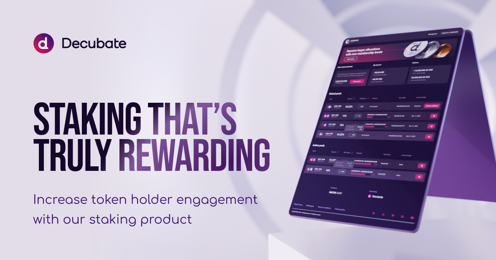

# Staking

Take control of your token economy. Deliver compelling staking experiences to reward long-term holders, fast.

- Staking portal: a user friendly yet sophisticated staking portal that supports a wide array of strategies and reward types.
- Highly customizable: all portal design elements are configurable to deliver a seamless brand experience. 
- Safe & secure: EVM compatible smart contract audited by an industry-leading security firm.
- Setup in minutes: our intuitive portal management panel makes staking pool setup hassle free.

## Benefits
- Instantly increase token utility.
- Incentivize and reward token holders with passive yields.
- Improve token price stability by locking circulating tokens.

## Features
1. Intuitive UX for ease of use across all devices. 
2. Customize all design elements including staking portal color, buttons, logo, fonts and more. 
3. Multiple staking staking reward strategies supported including compounding rewards, NFT rewards and more.
4. Portal management panel to generate staking strategies in minutes. 
5. Analytics dashboard to access token holder insights. 
6. Fully audited EVM compatible smart contract. 
7. Leading wallets supported including Metamask, Trust Wallet, Coin98 Wallet, Wallet Connect and more. 
8. Multiple blockchain supported including Binance Smart Chain, Ethereum, AVAX and Polygon.

## Some of our clients

1. Algoblocks: https://www.algoblocks.io/ 
2. ARize: https://www.arize.io/
3. Chirpley: https://chirpley.ai/ 
4. Digital Arms: https://www.hunter-token.com/ 
5. Ethereum Towers: https://ethereumtowers.com/

## Testimonials
“We used Decubate’s staking product to quickly establish a staking solution before listing our ALGOBLK token on exchanges. Whilst we reviewed other vendors in the market and even considered building our own, we found Decubate’s solution to be innovative, fair priced and easy to implement.”

_AlgoBlocks CEO, Joseph Kim_

## Demo
Contact us to learn more about Decubate Staking: https://share-eu1.hsforms.com/1MAJTri8sRxO5OmKL7DaktQf5bmh

## Audit
The Decubate Staking smart contract has been successfully audited by Haechi. An industry leading auditing firm, Haechi has completed smart contract audits for over 300 partners including the Ethereum Foundation, 1inch and SushiSwap.

Audit report: https://github.com/Decubate-com/public-repository
