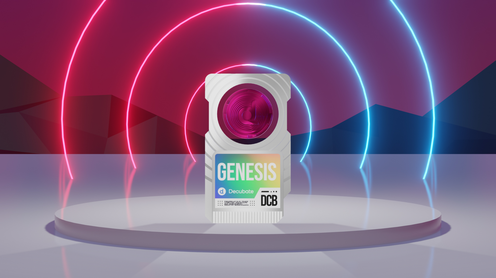

# Decubate Genesis NFT

The Decubate Genesis NFT is a unique digital asset within the Decubate ecosystem. Its primary utility is to improve user experience by providing enhancements such as an automatic boost to their staking experiences on the Decubate platform, subject to market conditions and the amount of DCB tokens staked.

## How Genesis NFT works
Users can hold the Genesis NFT in their wallets. By staking DCB tokens on the Decubate platform and simultaneously holding the Genesis NFT, an enhancement to the user's staking experience is automatically applied.

**Genesis NFT Process:**
1. Hold the Genesis NFT in your wallet
2. Stake DCB tokens on the Decubate platform
3. The smart contract system recognizes the NFT and enhances the staking experience

## Where can I buy a Genesis NFT?
Decubate has minted several NFTs for different project but there is only one Decubate Genesis.

***You can buy Genesis NFT on the following market places:***
[!ref target="blank" text="Tofunft"](https://tofunft.com/collection/decubate/items)
[!ref target="blank" text="NFTrade"](https://nftrade.com/collection/decubate?traitIds=)
[!ref target="blank" text="Opensea"](https://opensea.io/collection/decubate)

## Disclosure
The Decubate Genesis NFT should not be seen as a traditional investment and does not constitute a security. Acquisition of a Genesis NFT does not represent an investment in a common enterprise, and it does not grant any equity, debt, cash flow rights, or any other form of financial interest in Decubate or any affiliated entity.

The Genesis NFT provides a range of benefits such as special status recognition, potential access to exclusive platform features, and other privileges. However, these benefits are subject to change and are dictated by the terms and conditions of Decubate.

The Genesis NFT is not a digital currency, security, commodity, or any kind of financial instrument and has not been registered under the securities laws of any jurisdiction, including the Netherlands. All NFT transactions are final; purchases cannot be reversed, and there is no guarantee of any resale market for the Genesis NFT.

Potential holders of the Genesis NFT are urged to consult their legal, financial, tax, and other professional advisors before deciding to purchase a Genesis NFT.