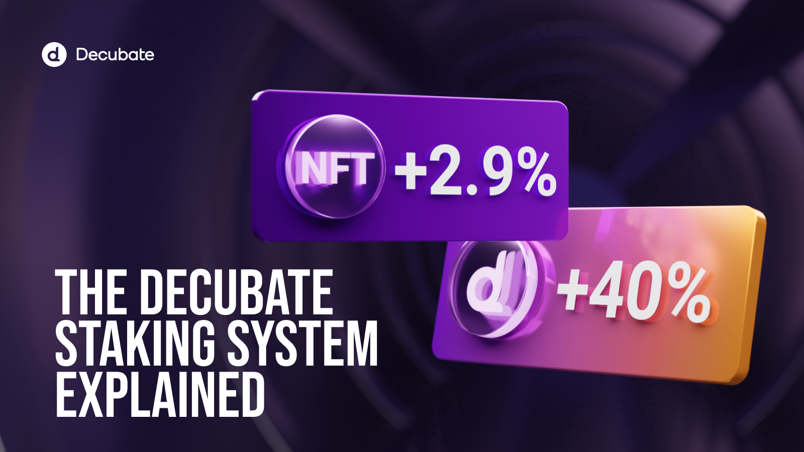

# Introduction to Staking at Decubate
--
In Decubate, staking is crucial in allowing users to increase their involvement and move up in the [Tier System](https://docs.decubate.com/the-launchpad/tier-system/). When users stake DCB tokens, they guarantee a continuous flow of rewards and play a key role in maintaining the platform's liquidity and stability. Moreover, the Annual Percentage Yield (APY) for staking differs based on your choice of pool; the longer you lock your tokens, the greater the rewards you receive, and the greater your boost for increasing the investor tier.

## How Staking Elevates Your Decubate Experience
### Boosting Your Tier
Staking directly influences your position within the Decubate Tier System. Each token you stake *bolsters your tier status*. This progression is crucial as it unlocks incremental benefits and rewards at each new tier level. For example:

- Staking DCB for 120 days results in a **+20% boost** to your tier level.
- Locking DCB for a full year gives you a **+50% boost**.

These enhancements make it easier to climb the tier ladder by reducing the number of DCB tokens needed to reach higher tiers. 
Additionally, Decubate offers *Liquidity Staking* options such as the USDT/DCB pool, which provides a **100% boost** for tier progression.

### Earning Through Liquidity Pools
Whan to receive a portion of trading fees happening on our primary DEX? Explore our Liquidity Pool.
What is Liquidity Staking?

Liquidity staking allows users to generate Liquidity Pool (LP) tokens by locking two types of tokens—such as DCB and USDT on the Binance Smart Chain—into a smart contract. These LP tokens are essential for trading on decentralized exchanges as they represent a share of the liquidity pool, making trading possible. When you provide tokens to the pool, you receive LP tokens in return, which signify your portion of the pool and allow you to earn rewards from your investment.

:bulb:**Importantly, all rewards and yields from Decubate staking are compounded automatically, maximizing your investment returns and simplifying your financial strategy.**

_While staking brings numerous benefits, it's important to be aware of potential risks such as impermanent loss. This occurs when the price ratio of staked tokens changes compared to when they were deposited in the pool. Decubate is committed to providing education and tools to help manage this risk effectively._
[!ref target="blank" text="Stake Now"](https://platform.decubate.com/staking)

## Transition from Legacy Staking Pools
You probably have noticed that on our [Staking Page](https://platform.decubate.com/staking) there are two ways of staking: Staking and Legacy Staking. As part of our ongoing efforts to enhance the Decubate platform experience, we are phasing out the Legacy Staking pools. These older pools, based on initial smart contracts, will no longer be issuing rewards as they are set to expire systematically. It is important for users currently invested in these legacy pools to _migrate their funds to the new staking pools_ to continue earning rewards.

The latest staking pools on Decubate provide enhanced security, efficiency, and features that cater to our platform's growth and our community's changing needs. By transferring your funds, you can maintain eligibility for the attractive APYs and tier perks available in our revamped staking program. How to do it? Migrating is simple and straightforward:

- Visit the staking section on the Decubate platform.
- Wait for the Staking Terms Expirations and follow the guided steps to withdraw your funds from the legacy pools.
- Re-stake your tokens into any of the new pools to continue earning rewards without interruption.

Our team is committed to making this transition as smooth as possible and is available to assist you with any questions or concerns you might have.

### A Recap with Emma's Journey :girl:
Emma’s journey continues as she explores the benefits of Decubate's staking program, designed to maximize her investments and secure her position within the community:

- **Tier Boosts**: Emma enjoys significant boosts to her tier level;
- **Extra high APY in DCB**: locking liquidity.
- **Transaction Fee Earnings**;
- **Automatic Compounding**: Her returns are maximized through automatic compounding of all staking rewards;
- **Enhanced Security**: With the transition to new staking pools;
- **Boosted rewards** by holding [Genesis NFTs](https://docs.decubate.com/the-launchpad/genesis-nft/)!

[!ref target="blank" text="Ready to provide Liquidity?"](https://platform.decubate.com/staking)