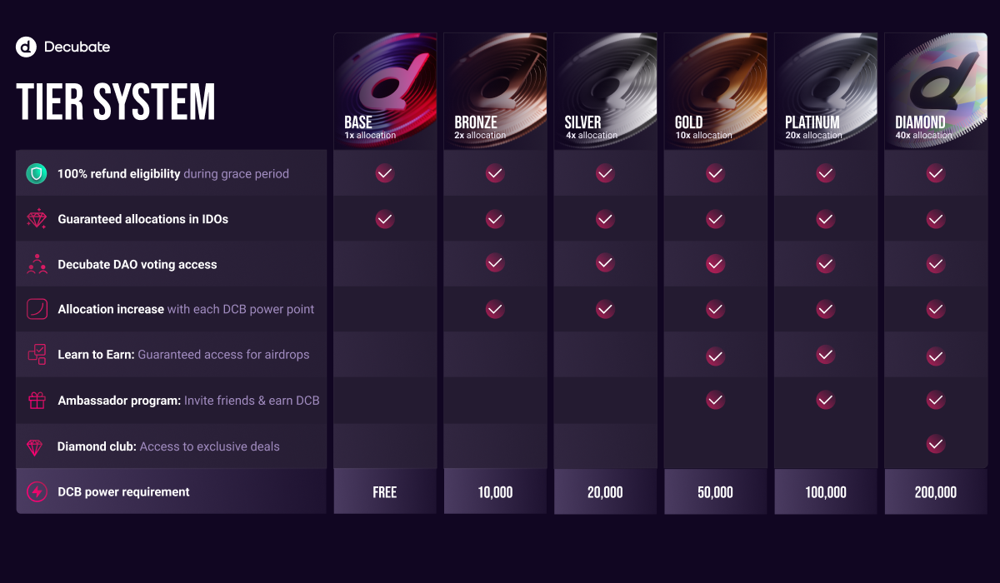

# **Tier System & Allocation**

The Decubate Tier System is a clear system that determines the access and perks users receive based on their platform activity, specifically the $DCB tokens they stake. It aims to **motivate and compensate users for engaging with the ecosystem**, ultimately making investing more accessible and promoting greater user participation.
--

## **Tier Rewards: Your Benefits Unlocked**
The Tier System is crucial because it customizes investment experiences, aligning rewards for active users and newcomers. This fosters long-term commitment and stable growth for the platform and its users. Here the benefit you can have based on yout tier:

- **100% Refund Eligibility**: from the Base Tier, users during the Grace Period can obtain a full refund, providing a safety net for new investments.
- **Guaranteed Allocations (GA) in IDOs**: from the **Free Base Tier** upwards, users receive guaranteed token allocations in IDOs.
- **Voting Access**: beginning with Bronze, users get a say in Decubate's governance through voting rights.
- **Allocation Increases**: every tier up from Base **provides an increase in IDO allocation**, doubling from Bronze to Silver and so forth. Reaching the Diamond Tier is an achievement, but it's not the final destination. For the highly invested members, the option to stake more DCB tokens opens the door to even higher echelons, such as Diamond 2 Tier and beyond. For example, staking 400,000 DCB tokens would place you in Diamond 2 Tier, doubling the multiplier effect of your investments and influence within the ecosystem.
- **Learn to Earn Access**: gold and higher tiers offer guaranteed access to educational events with token airdrops (This may vary based on the project: in the past we hosted L2E Events also from the Base Tier).
- **Ambassador Program**: exclusive to the Gold Tier and higher tier, members can refer friends and earn $DCB tokens.

:bulb: Members have the opportunity to increase their tier status by choosing longer staking periods. By locking DCB tokens for an extended time, you not only **earn higher annual percentage yields (APYs)**, but also **receive significant boosts to your tier level**. 
For example:
- Staking DCB for 120 days results in a **+20% boost** to your tier level. 
- Locking DCB for a full year gives you a generous **+50% boost**. 
These boosts reduce the amount of DCB needed to stake in order to reach a specific tier, simplifying the process of moving up the tier ladder.
- Additionally, Decubate offers options such as the USDT/DCB pool. This pool provides a **100% boost** for tier progression.

|||
|||

### The Tier System & Allocation Explained with an Example :girl:
- **Getting Started: Base Tier** Emma stumbles upon Decubate and is intrigued by its goal of making Web3 investments accessible to all. She creates a verified and KYCed account for free and is placed in the Base Tier, where she can experience the platform with 1x Guaranteed Allocations in IDOs and the option for a 100% refund during the Grace Period. 
- **Advancing: Bronze to Gold Tiers** After seeing some success, Emma decides to stake 10,000 DCB tokens, moving her up to the Bronze Tier. In this tier, she now has access to 2x IDO allocations and can participate in platform decisions through DAO voting. Emma continues to progress, increasing her stake gradually and moving up to the Silver and Gold Tiers. Along the way, she gains more allocations and gains entry to exclusive Learn to Earn events. 
- **The Peak: Platinum and Beyond** After hard work and smart financial decisions, Emma has achieved a major milestone. She has advanced to the prestigious Diamond Tier, which is a significant increase from her previous Platinum Tier status. As a Diamond Club member, she now enjoys even greater benefits such as 40x allocations in IDOs and exclusive deals offered only to members of this elite group. :point_down:

[!ref target="blank" text="Start Your Climb, Start Staking"](https://platform.decubate.com/staking)
### Previous Allocations Based on Tier Levels
--
The allocation for each Tier level in some of our previous IDO is presented in the table. It's crucial to note that this **allocation may vary based on the number of whitelisted participants**. Specifically, as the number of whitelisted individuals increases, the total allocation will be divided among participants accordingly.

[!ref target="blank" text="Get Your Tier Today"](https://platform.decubate.com/staking)

|||
|||

## **The Diamond Club**
--
:gem: Diamond Tier Members have access to exclusive deals like [Read More](https://www.decubate.com/blog/decubates-diamond-club-the-apex-of-crypto-elite):
- Exclusive Access and Networking;
- Priority Token Allocations and Private IDO Rounds;
- Early Access to Innovations;
- Direct Communication with Decision-Makers;
- More to come! :point_down:

[!ref target="blank" text="Create your account"](https://platform.decubate.com/register)

