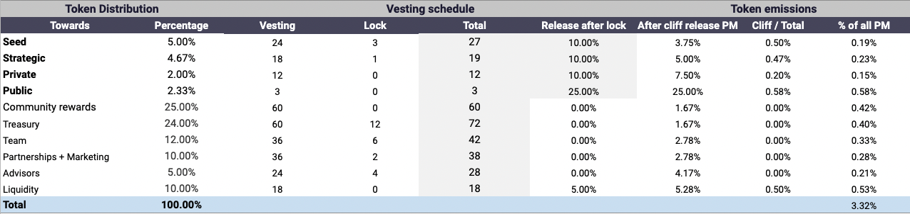
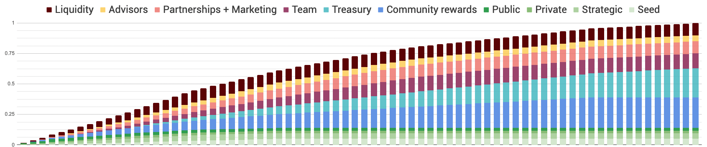
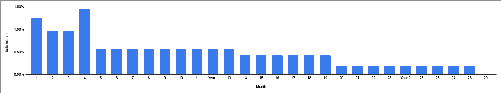

Decubate's token, DCB, is a critical component of our ecosystem. It provides investment rights to stakers, enables community governance, and facilitates access to our products and services. Our tokenomics have been carefully designed to ensure the long-term success of our platform and the value of DCB.

### Token Distribution
We have a total token supply of 1 billion DCB. The distribution of tokens is as follows:

Decubate's token distribution is designed to promote a fair and balanced distribution of tokens among key stakeholders in the ecosystem. By allocating a significant portion of tokens to community rewards, Decubate is demonstrating its commitment to building a strong and engaged community of supporters who will have a vested interest in the success of the project. 

#### Treasury tokens
By allocating a portion of tokens to the treasury, Decubate is ensuring that the project has the resources it needs to fund ongoing development and expansion, while still maintaining a significant portion of tokens for the community. 

It's important to note that Decubate has a profitable business model and<b> does not rely on these tokens for continuous operations</b> and does not intend to liquidate any tokens without the consent of a governance proposal.

### Token Vesting

One of the many positive aspects of Decubate's token vesting durations is that they are structured to encourage long-term commitment and investment. By gradually releasing tokens over a period of time, token holders are incentivized to remain invested in the project, rather than selling their tokens immediately after receiving them. This can help to create a more stable and committed community of token holders, who are aligned with the long-term success of the project. Additionally, by gradually releasing tokens, the potential for a large influx of tokens hitting the market and causing price volatility is minimized, creating a more stable and predictable market for the token.

### Early DCB investor emissions
Full vesting duration for all early DCB investors will take place in 28 months. We expect early investor sell pressure to ease up significantly after 19 months (January 2023) from 0.42% to 0.19% monthly emissions.

## Conclusion
Decubate's tokenomics are designed to ensure the long-term success of our platform and the value of our token. With carefully controlled distribution, vesting periods, and a token burn mechanic, we aim to create a sustainable ecosystem that benefits all stakeholders.